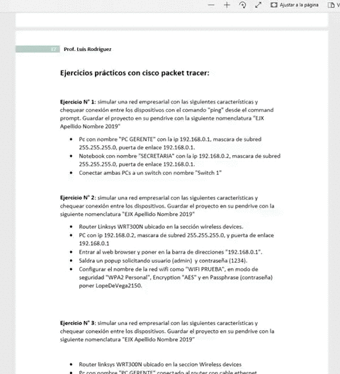

<p align="center">
  <a target="_blank" href="http://www.tecnica35.com.ar">
    
  </a>

  <h2 align="center">Administración de sistemas y redes de computadoras</h2>

  <p align="center">
      El siguiente repositorio fue creado para compartir los ejercicios propuestos por <a href="https://github.com/Luis3518">Luis Rodriguez</a> profesor de la materia de sexto año "Administración de sistemas y redes de computadoras" de la 
  <a href="https://github.com/othneildrew/Best-README-Template"><strong> Escuela Técnica N°35 "Ing. Eduardo Latzina".</strong></a>
    <br />
    <a href="https://github.com/pablorea/Administracion-de-sistemas-y-redes"><strong>« Explorar contenido »
    </strong></a>
    <br />
    <br />
    <a href="#">Apuntes</a>
    ·
    <a href="#">Ejercicios</a>
    ·
    <a href="#">Instalción</a>
    .
    <a href="#d">Licencia</a>

  </p>
</p>

## Contenido del repositorio

* [Cisco Packet Tracer](#Cisco-packet-tracer)
  * [Software](#Software)
* [Apuntes y ejercicios ](#Apuntes-y-ejercicios)
* [Instalación](#Instalación)
* [Licencia](#Licencia)

# Cisco packet tracer
<p>Cisco desarrolló Packet Tracer para ayudar a los estudiantes de Networking Academy a lograr la experiencia de aprendizaje más óptima mientras adquieren habilidades prácticas de tecnología de redes.

Es una poderosa plataforma de simulación de red que inspira a los estudiantes a experimentar con el comportamiento de la red y hacer preguntas de "qué pasaría si". Complementa el equipo físico en el aula al permitir a los estudiantes crear una red con un número casi ilimitado de dispositivos, fomentando la práctica, el descubrimiento y la resolución de problemas.</p>

### Software
El software necesario para poder visualizar la ejercitacion puede ser descargado de la página web oficial de Cisco o bien ser descargado desde este repositorio.

* [Cisco Packet Tracer](https://www.netacad.com/courses/packet-tracer) 


# Apuntes y ejercicios

<p>El listado de ejercicios propuestos se puede encontrar al pie del archivo PDF junto con un cuestionario.</p>
<p align="center">

</p>

# Instalación

```bash
# Clonar el repositorio 
git clone https://github.com/pablorea/Administracion-de-sistemas-y-redes.git

# Ve al repositorio
cd Administracion-de-sistemas-y-redes
```
2. Instala [Cisco Packet Tracer](https://www.netacad.com/courses/packet-tracer)

## Licencia

Software de dominio público. Ver`LICENSE` para más información.

